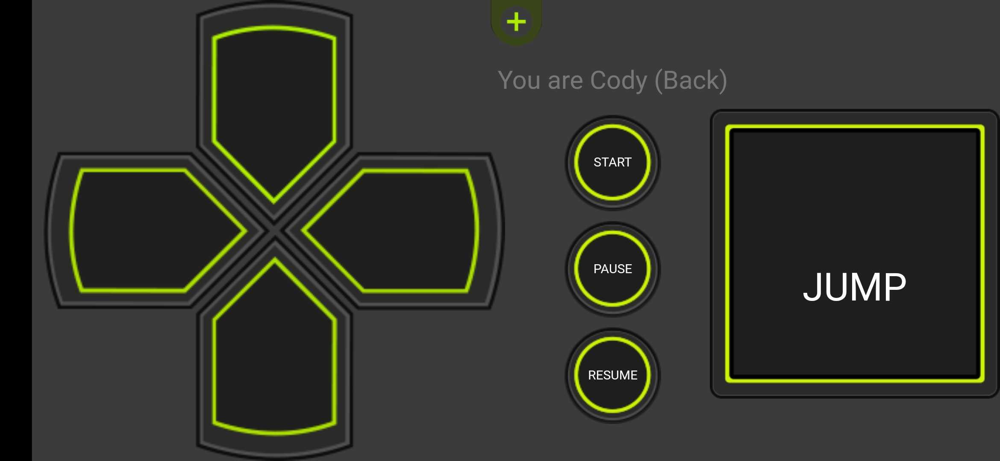

# BVW_Round3
This is a one-week project for BVW course at CMU ETC with a group of 4. We used Airconsole plugin so that players can play together on the same screen and use their phones as controllers. 

In this game, two players will be collaborating to get our drunk protagonists in a horse costume to the door in a party. One player will be controlling the front person, and the other player will be controlling the back person.

## My contribution to this project
#### Dpad controller on the phone

#### Cooperated with another programmer on movement control

#### Chat messages from the Ubeer driver

## Click the image to watch the full gameplay video!
This is the one-week project I made for BVW course at CMU ETC. It was built with WebGL and used AirConsole for multi-player game.

